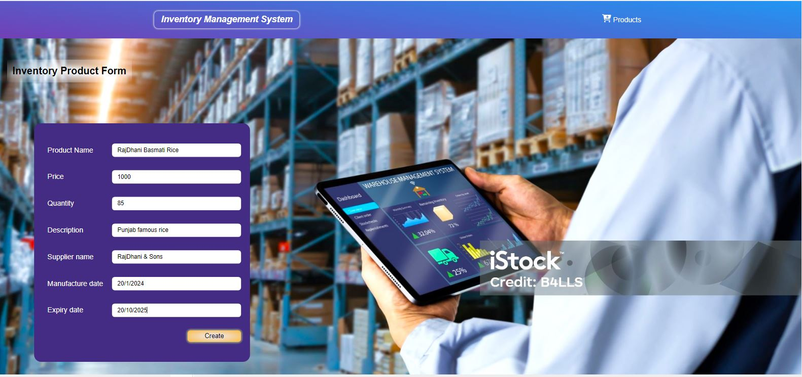
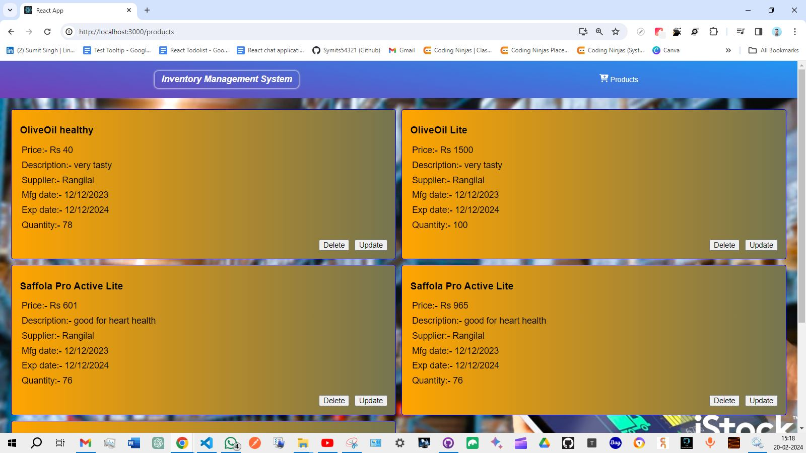

# Inventory Management System (MERN Project)

## Introduction
Welcome to the Inventory Management System! This project is built using the MERN stack (MongoDB, Express.js, React.js, Node.js). It allows users to manage inventory by performing CRUD (Create, Read, Update, Delete) operations on products.

## Demo of CRUD operation in App
[Watch Demo on YouTube](https://youtu.be/p90kZwRzoWA)

## Server Setup
### Installation
1. Navigate to the `server` directory.
2. Run `npm install` to install dependencies.
- 

### Starting the Server
- Start the server by running `npm start`.
- Upon successful start, you'll see the message:
- 

### Endpoints
- **Create a Product:** `POST /products/create`
- **Get All Products:** `GET /products/get`
- **Update a Product:** `PUT /products/update/<_id>`
- **Delete a Product:** `DELETE /products/delete/<_id>`

## Client Setup
### Installation
1. Navigate to the `client/inventory` directory.
2. Run `npm install` to install dependencies.
- 

### Starting the React App
- Start the React app by running `npm start`.
- The app will open in your default browser at http://localhost:3000.

## Usage
1. Use the navigation buttons to access different sections:
 - **Home:** Click on the logo.
 -   

 - **Products:** Click on the "Product" button.
 -   

2. On the Product page, you can perform CRUD operations on products.
3. [Click to watch the demo](https://youtu.be/p90kZwRzoWA)

## Notes
- Ensure that the server is running for successful frontend communication to backend server for CRUD operations .
- Make sure your MongoDB service is running properly on your operating system.
